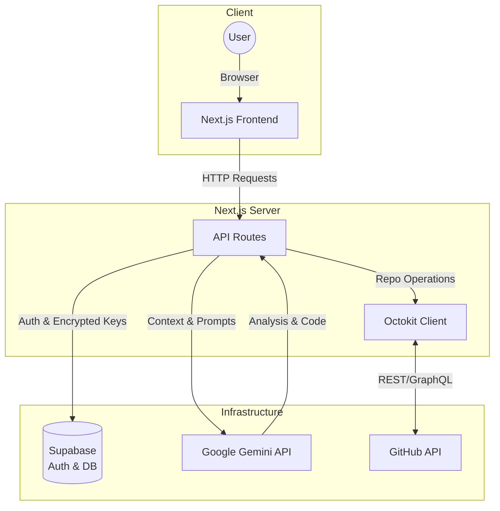

This document provides comprehensive technical documentation for **GitMind**, an intelligent GitHub repository management tool powered by Google Gemini. It details the system's architecture, guides through the setup process, clarifies its API interactions, and outlines potential future developments.

---

## Table of Contents

1.  [Problem Statement](#1-problem-statement)
2.  [System Architecture Overview](#2-system-architecture-overview)
3.  [Getting Started Guide](#3-getting-started-guide)
    *   [Prerequisites](#prerequisites)
    *   [Local Setup](#local-setup)
    *   [Supabase Configuration](#supabase-configuration)
    *   [Generating an Encryption Key](#generating-an-encryption-key)
    *   [Running the Development Server](#running-the-development-server)
4.  [API Reference (Internal Integrations)](#4-api-reference-internal-integrations)
    *   [GitHub API (via Octokit)](#github-api-via-octokit)
    *   [Google Gemini API](#google-gemini-api)
    *   [Supabase API](#supabase-api)
5.  [Future Roadmap](#5-future-roadmap)

**Public Project Link:** [git-mind-delta.vercel.app](https://git-mind-delta.vercel.app/)
**Public Code Repository:** [github.com/rickrods/GitMind](https://github.com/rickrods/GitMind)

---

## 1. Problem Statement

Modern software development involves managing complex codebases, high volumes of issues, and intricate CI/CD pipelines. Developers and maintainers face significant challenges:

*   **Information Overload:** Sifting through hundreds of issues to identify critical bugs versus feature requests.
*   **Context Switching:** Constantly moving between IDEs, GitHub, and logs breaks flow.
*   **Repetitive Tasks:** Manually triaging issues, writing boilerplate documentation, and analyzing standard CI failures consumes valuable time.

GitMind addresses these by acting as an intelligent layer between the developer and the repository, leveraging Large Language Models to automate understanding and action.

## 2. System Architecture Overview

GitMind is built as a full-stack Next.js application, leveraging server-side rendering and API routes to orchestrate interactions between GitHub, Google Gemini, and Supabase. The architecture emphasizes modularity, security, and scalability.



**Core Components:**

*   **Frontend (Next.js & UI Frameworks):**
    *   **Next.js 16 (App Router):** Provides the foundational framework for both client-side rendering and server-side logic (API routes, data fetching).
    *   **Tailwind CSS & shadcn/ui:** Used for building a responsive, modern, and aesthetically pleasing user interface.
*   **Backend (Next.js API Routes):**
    *   Serves as the central hub for processing requests, interacting with external APIs, and managing data.
    *   Handles authentication flows and secure credential management.
*   **AI Engine (Google Gemini):**
    *   **Gemini Flash & Pro models:** Power all AI-driven features, including issue triage, deep analysis, automated fixes, CI analysis, documentation generation, and code reviews.
    *   Interacts with the backend via the Google Gemini API.
*   **Database & Authentication (Supabase):**
    *   Provides a PostgreSQL database for storing application data.
    *   Manages user authentication and authorization.
    *   Crucially, it securely stores AES-256 encrypted GitHub Personal Access Tokens (PATs) and Gemini API keys.
*   **GitHub Integration (Octokit):**
    *   **Octokit:** The official GitHub SDK for Node.js, used for all interactions with the GitHub API. This includes fetching repository information, reading/writing issues and pull requests, managing branches, and accessing code.

**Data Flow and Interactions:**

1.  **User Authentication & Credential Storage:**
    *   Users interact with the GitMind frontend.
    *   When required, users provide their GitHub PAT and Gemini API key.
    *   These sensitive credentials are **AES-256 encrypted** using a unique `ENCRYPTION_KEY` (configured locally) before being stored in the Supabase database.
    *   Supabase handles user management and secure storage, ensuring that credentials are never stored in plain text.
2.  **GitHub Repository Interaction:**
    *   User actions (e.g., initiating an issue triage or code review) trigger API calls from the frontend to Next.js backend routes.
    *   The backend decrypts the user's GitHub PAT (using the `ENCRYPTION_KEY`) and initializes Octokit.
    *   Octokit makes requests to the GitHub API to fetch repository data (issues, PRs, code files, CI logs, etc.).
3.  **AI Processing:**
    *   Relevant context from GitHub (e.g., issue descriptions, code diffs, CI logs) is extracted by the backend.
    *   This context, along with the decrypted Gemini API key, is sent to the Google Gemini API (Flash or Pro model) for processing.
    *   Gemini performs the requested AI task (analysis, generation, review) and returns the results to the Next.js backend.
4.  **Result Presentation:**
    *   The Next.js backend processes Gemini's output.
    *   For features like "Automated Fixes," the backend might use Octokit to create new branches and submit pull requests to GitHub based on Gemini's suggestions.
    *   Finally, the results are sent back to the frontend for display to the user.

**Security Considerations:**

*   **AES-256 Encryption:** All sensitive API keys and tokens are encrypted at rest using a robust, symmetric encryption algorithm.
*   **Environment Variables:** Critical keys (Supabase, encryption key) are managed via environment variables, preventing hardcoding in the codebase.
*   **Server-Side Processing:** AI interactions and GitHub API calls are handled server-side, minimizing exposure of sensitive data on the client.
*   **Strict Access Control:** Supabase's built-in authentication and Row Level Security (RLS) can be configured to ensure users only access their own encrypted credentials.

## 3. Getting Started Guide

This guide will walk you through setting up GitMind for local development.

### Prerequisites

Before you begin, ensure you have the following installed on your system:

*   **Git:** For cloning the repository.
*   **Node.js:** Version 18 or higher is recommended. You can download it from [nodejs.org](https://nodejs.org/).
*   **npm:** Node Package Manager, usually installed with Node.js.

### Local Setup

1.  **Clone the project:**
    Open your terminal or command prompt and run:
    ```bash
    git clone https://github.com/rickrods/GitMind.git
    cd GitMind
    ```

2.  **Install dependencies:**
    Navigate into the cloned directory and install the required Node.js packages:
    ```bash
    npm install
    ```

### Supabase Configuration

GitMind uses Supabase for database operations and authentication. You'll need to set up a new Supabase project to get your project URL and public key.

1.  **Create a Supabase Project:**
    *   Go to [Supabase](https://supabase.com/) and sign up or log in.
    *   Click "New project" and follow the prompts to create a new project.
    *   Note down your project's region and database password.

2.  **Retrieve Supabase Credentials:**
    *   Once your project is created, navigate to **Project Settings** > **API**.
    *   You will find your `Project URL` (e.g., `https://your-project-ref.supabase.co`) and `anon public` key (labeled `NEXT_PUBLIC_SUPABASE_ANON_KEY` or similar).

### Generating an Encryption Key

The `ENCRYPTION_KEY` is crucial for securely encrypting and decrypting your GitHub and Gemini API secrets. It must be a strong, unique, 32-byte Base64 encoded key.

To generate a suitable key, you can use OpenSSL in your terminal:

```bash
openssl rand -base64 32
```
Copy the output of this command.

### Configure Environment Variables

Create a file named `.env.local` in the root of your `GitMind` project directory. Populate it with the following variables, replacing the placeholders with your actual credentials:

```bash
# Supabase Configuration
NEXT_PUBLIC_SUPABASE_URL=YOUR_SUPABASE_PROJECT_URL
NEXT_PUBLIC_SUPABASE_PUBLISHABLE_DEFAULT_KEY=YOUR_SUPABASE_ANON_KEY

# Encryption Key (MUST be 32 bytes base64 encoded)
ENCRYPTION_KEY=YOUR_GENERATED_BASE64_ENCRYPTION_KEY
```

> [!IMPORTANT]
> *   The `ENCRYPTION_KEY` is absolutely critical for the security of your GitHub and Gemini API keys. Do not share it, and ensure it is kept secret.
> *   Do not commit your `.env.local` file to version control. The `.gitignore` file should already exclude it.

### Running the Development Server

Once all environment variables are configured, you can start the development server:

```bash
npm run dev
```

Open your web browser and navigate to [http://localhost:3000](http://localhost:3000) to view the GitMind application.

## 4. API Reference (Internal Integrations)

GitMind does not expose a public API for external consumption. Instead, it acts as a client to several powerful third-party APIs to deliver its features. This section details how GitMind internally utilizes these integrations.

### GitHub API (via Octokit)

GitMind leverages the GitHub API, primarily through the Octokit library, to perform all repository-related operations. User-provided GitHub Personal Access Tokens (PATs) grant GitMind the necessary permissions to interact with repositories.

**Key Operations Performed:**

*   **Repository Information:** Fetching details about repositories, branches, commits, and files.
*   **Issue Management:**
    *   Reading issue details, comments, and labels.
    *   Creating new issues.
    *   Updating issue properties (e.g., labels, assignees, status).
*   **Pull Request Management:**
    *   Reading PR details, diffs, comments, and review statuses.
    *   Creating new branches and submitting pull requests (for automated fixes).
    *   Adding comments or review suggestions to PRs.
*   **Code Access:** Reading file contents from specific branches or commits for analysis and documentation generation.
*   **CI/CD Workflow Analysis:** Accessing workflow run logs to identify failures and extract relevant information.

### Google Gemini API

The Google Gemini API is the backbone of GitMind's intelligent features. GitMind interacts with Gemini's models (Flash and Pro) to process information and generate insights.

**Gemini 3 Integration & Capabilities:**

GitMind leverages the cutting-edge capabilities of Gemini 3 to redefine the developer experience. At its core, the application utilizes **Long Context Windows**—processing up to 100k+ tokens of codebase structure, diffs, and logs—to provide deep technical insights that were previously impossible.

We've implemented **Structured JSON Output** with strict **Response Schemas** throughout the stack, enabling Gemini to act as a reliable "AI Architect." This allows the system to not only analyze problems but to generate concrete, high-confidence **AI Proposals**. These proposals include full-file rewrites, branch names, and conventional commit messages, which are then automatically applied via our GitHub Service integration.

Beyond text, GitMind leverages Gemini's **Multimodal Capabilities** to analyze screenshots, UI mocks, and diagrams attached to GitHub issues and Pull Request comments. By "seeing" the visual context of a bug or feature request, the AI can cross-reference visual regressions with code changes, ensuring a comprehensive analysis that text-based triage would otherwise miss.

Crucially, we utilize Gemini's **Thinking Mode** (via `thinkingConfig`) for rigorous code reviews and CI failure analysis. By allowing the model to engage in extended reasoning before responding, it identifies subtle logic errors and security vulnerabilities that standard LLMs often miss. Whether it's triaging vague issues, processing complex build failures, or interpreting visual feedback, Gemini is the heartbeat of GitMind, transforming a static dashboard into an autonomous maintainer.

**Key Operations Performed:**

*   **Text Generation:**
    *   Analyzing issue descriptions for clarity, completeness, and identifying missing information.
    *   Generating detailed technical analysis, proposed fixes, and implementation plans.
    *   Automated creation of code changes and documentation snippets.
    *   Summarizing CI/CD logs to pinpoint root causes.
    *   Crafting comprehensive code review comments, quality scores, and best practice alignments.
*   **Chat Completions (Potentially):** While not explicitly stated, features like "AI Issue Triage" could involve multi-turn interactions with the AI to refine analysis or gather more context.
*   **Model Selection:** GitMind dynamically selects between Gemini Flash (optimized for speed) and Gemini Pro (optimized for quality and complexity) based on the task requirements.

### Supabase API

Supabase provides the backend infrastructure for GitMind, handling database interactions, user authentication, and secure storage of sensitive data.

**Key Operations Performed:**

*   **User Authentication:**
    *   Managing user accounts (sign-up, sign-in, session management).
    *   Authenticating users against the Supabase Auth service.
*   **Database Operations (CRUD):**
    *   Storing and retrieving user-specific data, including encrypted GitHub PATs and Gemini API keys.
    *   Managing application settings and configuration.
    *   Potentially logging AI interactions or feature usage for auditing and analytics.
*   **Security:**
    *   Leveraging Supabase's Row Level Security (RLS) to ensure that users can only access their own encrypted credentials and data.
    *   Utilizing Supabase's secure data storage for encrypted secrets.

## 5. Future Roadmap

GitMind is continuously evolving, with numerous possibilities for enhancing its intelligence and utility. The following outlines potential areas for future development:

*   **Expanded AI Capabilities:**
    *   **Proactive Monitoring:** Implementing AI agents that continuously monitor repositories for security vulnerabilities, performance bottlenecks, or code quality degradation, providing real-time alerts.
    *   **AI-driven Project Management:** Integrating with project management tools to automatically create, assign, and track tasks based on issue analysis or feature requests.
    *   **Intelligent Code Refactoring:** Suggesting and even automating complex code refactoring tasks to improve maintainability and performance.
    *   **Automated Test Generation:** AI-generated unit, integration, and end-to-end tests for new or modified code.
*   **Broader Platform Support:**
    *   Extending support to other popular Git hosting services like **GitLab** and **Bitbucket**, enabling a wider user base.
*   **Advanced Customization & Configuration:**
    *   Allowing users to define and fine-tune AI prompts, behaviors, and output formats to match specific team workflows and coding standards.
    *   Customizable automated workflows for issue triaging, PR reviews, and deployment processes.
*   **Enhanced User Experience & Integrations:**
    *   **CLI Tool:** A command-line interface for rapid interaction and integration into existing developer workflows.
    *   **Webhooks & APIs:** Providing webhook capabilities for real-time notifications and an external API for programmatic access to GitMind's features.
    *   **Advanced Analytics & Reporting:** Comprehensive dashboards providing insights into repository health, development velocity, and AI impact.
*   **Community & Extensibility:**
    *   Developing a **plugin architecture** to allow third-party developers to extend GitMind's functionality with custom AI models, integrations, or reports.