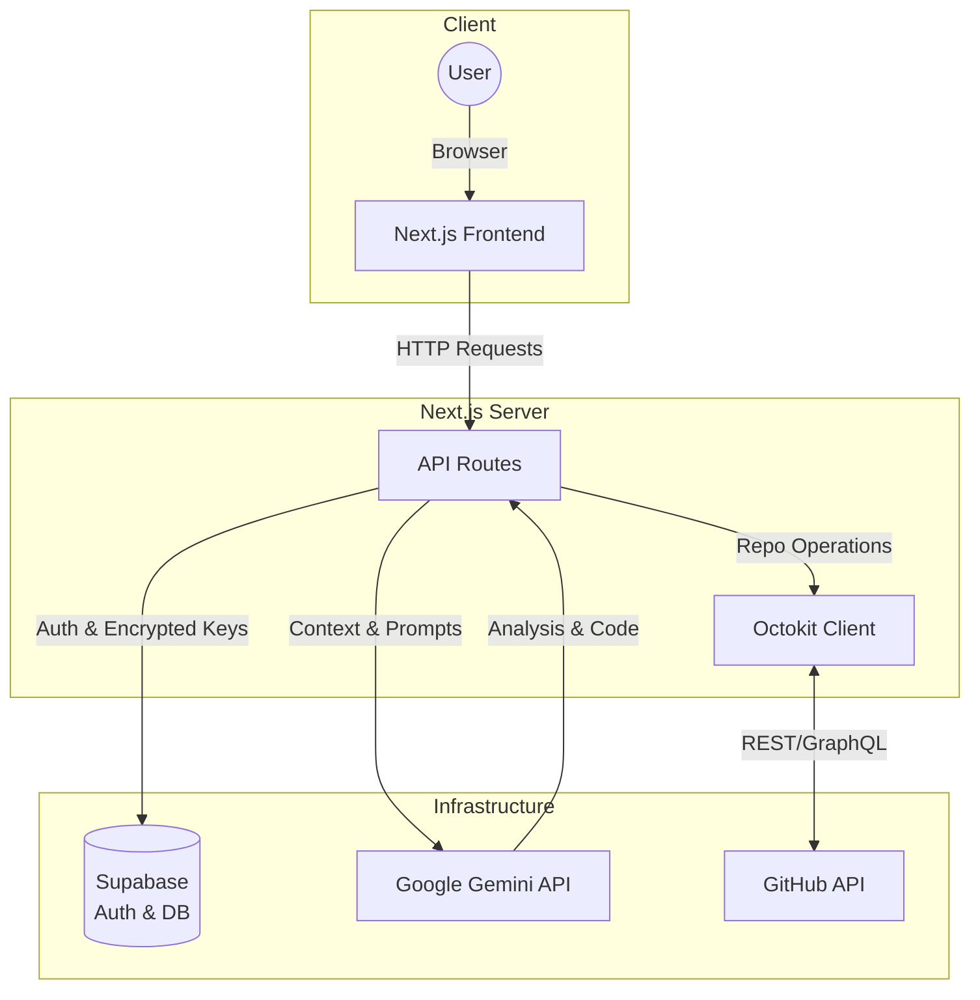
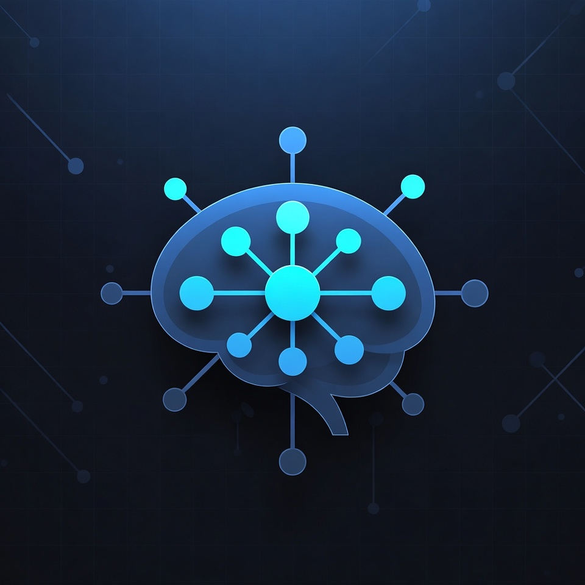

<h1 align="center">GitMind</h1>

<p align="center">
  <strong>Intelligent GitHub repository management powered by Gemini 3.</strong>
</p>

<p align="center">
  <a href="#features"><strong>Features</strong></a> ·
  <a href="#tech-stack"><strong>Tech Stack</strong></a> ·
  <a href="#local-setup"><strong>Local Setup</strong></a> ·
  <a href="#support"><strong>Support</strong></a>
</p>

---

## ⚡ Features

- 🔐 **Secure Credential Store** — AES-256 encrypted storage of GitHub PATs and Gemini API keys in Supabase.
- 🤖 **AI Issue Triage** — Automatically analyzes incoming issues for clarity, missing info, and automated labeling.
- 🔍 **Deep Analysis** — Technical analysis of issues with proposed fixes and implementation plans.
- �️ **Automated Fixes** — AI-generated code changes with automatic branch creation and PR submission.
- 🧪 **CI Analysis** — Analyzes failed CI/CD workflow logs to identify root causes and suggest corrections.
- 📝 **Documentation Gen** — Automated generation of technical documentation for your codebase.
- 🧐 **Code Review** — Rigorous PR reviews with quality scoring, logic checks, and best practice alignment.

---

## 🏗️ Architecture



---
## 🚀 Try it out 

<h3 align="left"><a href="https://git-mind-delta.vercel.app/">✨ Live Demo ✨</a></h3>


## 🛠️ Local Setup

### 1. Clone the project

```bash
git clone https://github.com/rickrods/GitMind.git
cd GitMind
```

### 2. Install dependencies

```bash
npm install
```

### 3. Configure environment variables

Create a `.env.local` file based on the provided requirements:

```bash
NEXT_PUBLIC_SUPABASE_URL=your_supabase_project_url
NEXT_PUBLIC_SUPABASE_PUBLISHABLE_DEFAULT_KEY=your_supabase_anon_key
ENCRYPTION_KEY=your_base64_encryption_key # 32 bytes base64 encoded
```

> [!IMPORTANT]
> The `ENCRYPTION_KEY` is critical for securing your GitHub and Gemini secrets. Use a strong, unique key. To generate a new key in linux
```bash
openssl rand -hex 16
```
### 4. Database Setup

1. Go to your [Supabase Project Dashboard](https://supabase.com/dashboard).
2. Navigate to the **SQL Editor** in the left sidebar.
3. Create a new query and paste the contents of `supabase/setup.sql`.
4. Run the query to set up the tables, RLS policies, and triggers.

### 5. Run the dev server

```bash
npm run dev
```

Open [http://localhost:3000](http://localhost:3000) in your browser to view the app.

---

## 🧩 Tech Stack

- **Framework:** [Next.js 16](https://nextjs.org) (App Router)
- **AI Engine:** [Google Gemini](https://ai.google.dev/) (Flash & Pro models)
- **Database & Auth:** [Supabase](https://supabase.com)
- **Styling:** [Tailwind CSS](https://tailwindcss.com) & [shadcn/ui](https://ui.shadcn.com)
- **Integration:** [Octokit](https://github.com/octokit) (GitHub API)

---

## 🤝 Support

- 🐛 Found a bug? [Open an issue](https://github.com/rickrods/GitMind/issues)
-  [Gitmind Documentation](https://github.com/rickrods/GitMind/blob/main/Documentation/generateDoc.md)
- 📚 [Next.js Documentation](https://nextjs.org/docs)
- 📚 [Supabase Documentation](https://supabase.com/docs)

---

## 📄 License
<h4 align="left"><a href="/LICENSE.md"> MIT</a></h4>
---